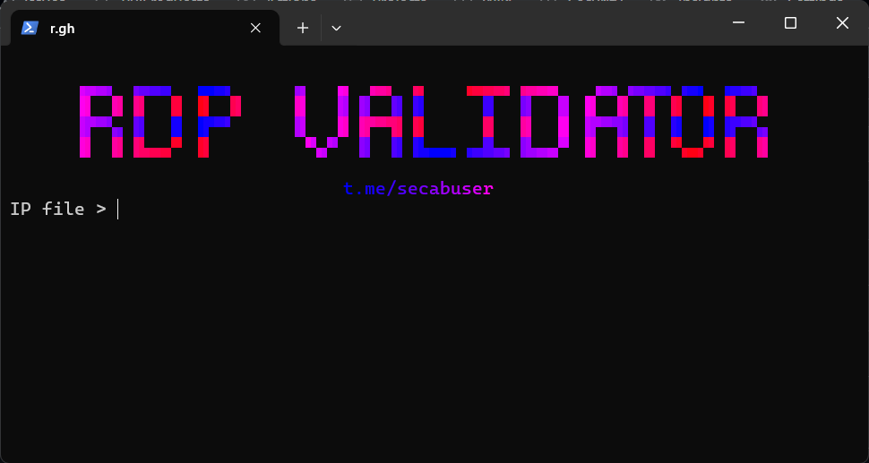

### **RDP Port & Login Checker**



>> A fast, multi-threaded Python scanner for checking Rdp(NlChecker) ;]

---


### **Features**

  * **Fast & Multi-threaded**
  * **Fully Flexible**
  * **Send Packet**

-----

### **Usage**

1.  **Prepare your input file:**
      * Create a text file (e.g., `ips.txt`) with a list of IPs. Supported formats:
        ```
        192.168.1.1:3389
        open tcp 3389 172.65.108.104 1755091431
        open tcp 3389 47.76.247.80 1755091431
        open tcp 3389 37.16.10.190 1755091431
        ```
2.  **Run the script:**
    ```bash
    python main.py
    ```
      * The script will prompt you for the input file, number of threads, timeout, and output file name.

-----

📢 **Telegram Channel:** [t.me/secabuser](https://t.me/secabuser)

-----
